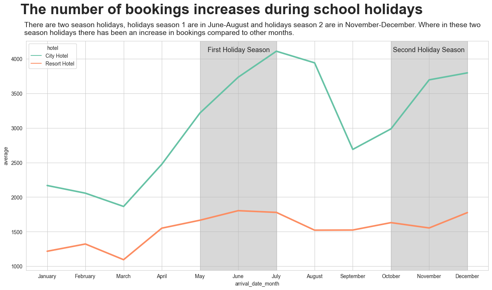
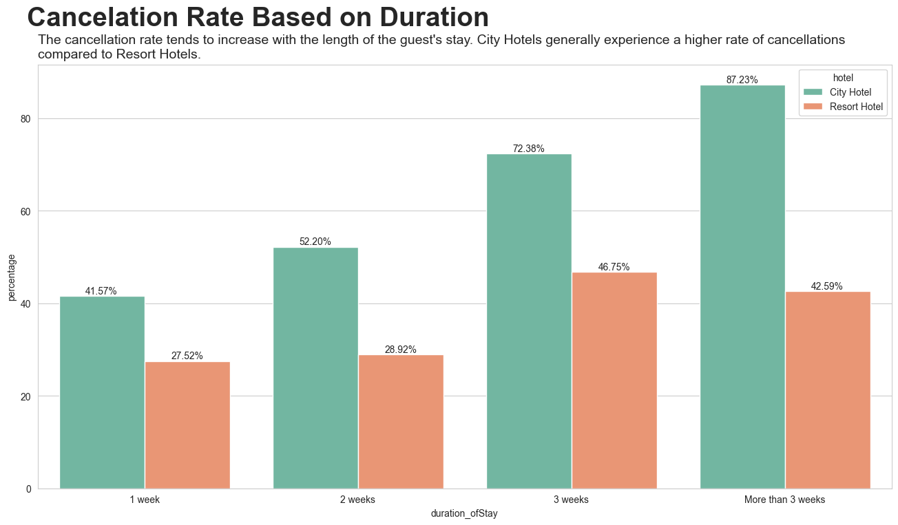

# Investigate Hotel Business Using Data Visualization

- Dataset: Sourced from [Rakamin Academy](https://github.com/kevinusmayadhyw/Investigate-Hotel-Business-Using-Data-Visualization/tree/main/dataset).
- Programming Language: Python Version 3.10.11
- Library:
    - pandas version 2.0.1
    - matplotlib version 3.7.1
    - seaborn version 0.12.2
    - numpy version 1.24.3

## Stage 0: Business Understanding
As data scientists, our responsibility is to unveil insights related to business performance, especially in this project about the domain of business hotels. This can be accomplished through Exploratory Data Analysis (EDA), and subsequently, visualizing the discovered patterns and trends using graph representations. The primary focus is to understand how customers behave when making hotel reservations and to explore the relationship between customer behavior and the rate of hotel reservation cancellations.

To conduct an analysis of the business performance as previously outlined, this project is organized into several stages, which include:
- Stage 1: Data Preprocessing
- Stage 2: Analysis of Monthly Hotel Booking Based On Hotel Type
- Stage 3: Analysis of Impact Stay Duration On Hotel Bookings Cancellation Rates
- Stage 4: Analysis of Impact Lead Time On Hotel Bookings Cancellation Rate

## Stage 1: Data Preprocessing
Before initiating data processing, the initial step is to prepare the raw data, transforming it into clean data that is ready for further processing. The preprocessing carried out consists of several stages, below are the details of the preprocessing carried out:
|Preprocessing|Finding|Handling|Explanation|
|-------------|-------|--------|-----------|
|Duplicate Value|There are 33261 rows of duplicate data.|Delete and only keep the first duplicate row.|So that there is no redundant data.|
|Missing Value|There are 4 columns that have null values, namely **children, city, agent, and company.**|- **children** are **dropped**  - **city** is filled with **unknown**   - **agent** is filled with **0**   - **company** is filled with **0**|- children are dropped because there are only 4 of them   - city is filled with unknown because the city cannot be known   - agent and company are filled with 0 because the guest does not come from the company and does not use an agency.|
|Data Cleaning|- There are **undefined values** in the meal, market_segment, and distribution_channel columns   - There is an **anomaly** value in **the number of guests** where some have **no guests** and in the **adr column** there is a **minus value**.|**Undefined Value**   - Meal is filled with No Meal   - market_segment and distribution_channel dropped.     **Anomaly Value**   - Removes rows that have guest count 0   - Delete rows that have minus values.|**Undefined Value**   - Regarding the undefined value in the meal column, it is assumed that it indicates a choice of not opting for a meal package.   - The undefined values in the market_segment and distribution_channel columns are assumed to have a negligible impact due to their small number.    **Anomaly Value**   - the number of guests has a value of 0 is considered an anomaly the number is small.   - Instances with a negative value, of which there is only 1 the number is very small.|

## Stage 2: Analysis of Monthly Hotel Booking Based On Hotel Type

Hotel reservations surge during the holiday season, with peak bookings occurring in July for City Hotels and June for Resort Hotels.

The first holiday season (May-July) aligns with a semester break, prompting numerous customers to book hotels as a means of alleviating stress from school, college, and work.

The second holiday season (October-December) spans both a semester break and the New Year, same as the stress-relief trend in the first holiday season, this holiday season also prompts numerous customers to book hotels.

Apart from the holiday season (January-April and August-September), the level of hotel bookings has decreased compared to the holiday season, this is because the holiday period has ended and most customers have returned to focusing on school, college, or work activities.

## Stage 3: Analysis of Impact Stay Duration On Hotel Bookings Cancellation Rates

The likelihood of cancellations generally rises with the length of the guest's stay, experiencing a notable increase when the stay duration is three weeks. Several reasons can make this phenomenon happen such as, prolonged stays often leading to heightened guest expectations. Then, the potential for changing plans increases with longer durations, as guests may reconsider and alter their plans, resulting in a higher probability of cancellations.

The City Hotel experiences the highest cancellation rate, especially when the stay duration exceeds three weeks, reaching 87.23%. This alarming trend warrants special attention as nearly every booking is canceled. My assumption is that in the City most guests an employees/businessmen, consisting mainly of employees or businessmen staying overnight for work-related purposes. It is likely that, once their work is completed or plans change, there is a reduced need for extended stays. However, further research is necessary to validate this assumption.

The Resort Hotel records its highest cancellation rate at 46.75% when the duration of stays spans three weeks, which is nearly half the rate observed in City Hotels. An assumption can be made that, in resorts, a significant portion of guests book for vacation purposes, leading to a lower likelihood of cancelation.

## Stage 4: Analysis of Impact Lead Time On Hotel Bookings Cancellation Rate

The City Hotel and Resort Hotel experienced their lowest cancellation rates during the first two months, with 27.87% and 17.39%, respectively. This phenomenon may be attributed to guests making urgent and necessary bookings within a short timeframe so the likelihood of cancellations during this period is low.

The highest cancellation rates are observed in the eleventh and twelfth months for both the City Hotel (78.12%) and the Resort Hotel (45.18%). This trend may be attributed to the long timeframe, leading to changes in guests' plans so they cancel their booking.

The City Hotel exhibits a higher cancellation rate compared to the Resort Hotel. This difference is likely influenced by the nature of guests at each location. In the City Hotel, where the majority of guests are employees or businessmen staying overnight for work-related reasons, frequent changes in plans may occur due to completed assignments or other work-related factors. On the other hand, the Resort Hotel where the majority of guests book for vacation purposes, has fixed plans and dates for vacation, and consequently, a lower frequency of cancellations.